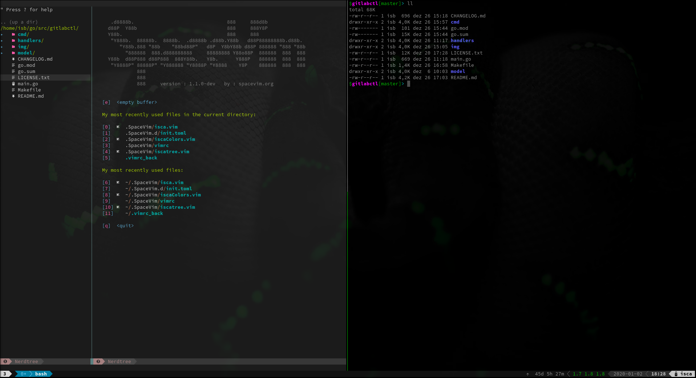

### dotfiles

These are my dotfiles, the expected result after the installation should be look like this:

  

#### Install
To install all the default dotfiles and themes use the `Makefile`:  
`make all`
_tested only on linux._
  
For more options use `make help`.
  
#### tmux 
By default tmux will use the plugins below and the powerline.
The tmux plugin manager[(tpm)](https://github.com/tmux-plugins/tpm) will be auto-installed. To install all the other plugins use
`prefix` + I
  
The expected tmux plugins tree will be like this:  
~/.tmux/plugins/  
├── tmux-resurrect  
├── tmux-sensible  
└── tpm  
  

#### default vim

Here is the option to use default vim instead of spacevim or nvim. Vim package manager is pathogen.  
You can install the default vim with `make nospace`  

The expected plugins and vim tree will be like this:  
  
~/.vim  
├── autoload  
│   └── pathogen.vim  
├── bundle  
│   ├── dracula-theme  
│   ├── indentLine  
│   ├── nerdtree  
│   ├── tagbar  
│   ├── vim-airline  
│   ├── vim-airline-themes  
│   ├── vim-go  
│   └── YouCompleteMe  
├── colors  
│   ├── dracula.vim  
│   └── PaperColor.vim  
├── confs  
│   ├── font  
│   └── vimgo  
├── paper  
│   ├── colors  
│   ├── DESIGN.md  
│   ├── LICENSE  
│   ├── README.md  
│   ├── ROADMAP.md  
│   └── test  
  
  
#### Spacevim 

For some unkown reason yet, the option `sidebar_direction = 'left'`, doesn't work anymore on spacevim toml.  
To fix that, I changed `.SpaceVim/config/plugins/nerdtree.vim` in the line `if get(g:, 'spacevim_filetree_direction', 'right') ==# 'right'` to `if get(g:, 'spacevim_filetree_direction', 'right') ==# 'left'`  
I will made a bether analisys on this case in future to fix this hardcode.  
There is an issue for that [here](https://github.com/SpaceVim/SpaceVim/issues/2263).  

#### i3

To configure i3 with i3blocks run `make i3` or use the `make all` command as mentioned above.

Enjoy :wink:
By: Isca
